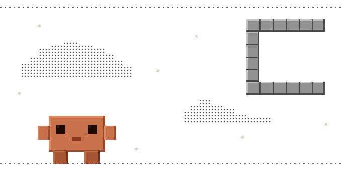

# Tyler-Sterkly Claude Plugins

<br>

Claude Code plugins by tyler-sterkly - skills for browser extension development, design, writing, and coding.




## Installation

**Step 1 - Add Marketplace:**

```
/plugin marketplace add tyler-sterkly/claude-plugins
```

**Step 2 - Install Plugin:**

```
/plugin install sys-logo@tyler-sterkly-claude-plugins
```

Or via the Claude Code CLI:

```bash
claude plugin marketplace add tyler-sterkly/claude-plugins
claude plugin install sys-logo@tyler-sterkly-claude-plugins
```

You can also browse and install interactively: run `/plugin`, open the **Discover** tab, and press Enter on any plugin to choose your install scope (user, project, or local).

<br>
<br>

## Plugins

### Design / Creative

| Plugin | Description |
|--------|-------------|
| `sys-logo` | Design and iterate on logos using SVG |
| `sys-svg` | Generate and edit SVG illustrations, icons, and graphics |
| `sys-web-audit` | Review interfaces against Vercel web design guidelines |

<br>

### Extension Dev

| Plugin | Description |
|--------|-------------|
| `ext-audit` | Score an extension across MV3 compliance, security, architecture, and code quality |
| `ext-changelog` | Public-facing changelog and commit message from diffs or version notes |
| `ext-context` | Generate a CLAUDE.md documenting the extension's architecture and conventions |
| `ext-duplicate` | Duplicate an existing extension template into a new instance |
| `ext-icons` | Generate a full icon set and favicon from a single source icon |
| `ext-ids` | Generate and wire unique Chrome and Firefox extension IDs |
| `ext-ingest` | Transform an extension ZIP into the standardized template structure |
| `ext-md` | Create or update the EXTENSION.md identity file for a Firefox extension |
| `ext-pnr` | Plan, findings, and progress tracking files for complex extension projects |
| `ext-publish` | Package, document, and submit an extension to the store |
| `ext-review` | Review an extension across code quality, security, AMO compliance, and performance |
| `ext-verbiage` | Generate user-facing copy: manifest descriptions, listing summaries, keyword sets |
| `ext-website` | Build a standalone brand site for an extension |

<br>

### Writing / Docs

| Plugin | Description |
|--------|-------------|
| `ext-changelog` | Public-facing changelog and commit message from diffs or version notes |
| `ext-legal` | GDPR/CCPA privacy policy and California-governed terms of service |
| `ext-md` | Create or update the EXTENSION.md identity file for a Firefox extension |
| `ext-verbiage` | Generate user-facing copy: manifest descriptions, listing summaries, keyword sets |

<br>

### Code Quality

| Plugin | Description |
|--------|-------------|
| `sys-catch` | Audit past conversations for missed improvements, log patterns to GOOD_CATCH.md |
| `sys-code-review` | Review PRs for bugs and CLAUDE.md compliance, post findings as a PR comment |
| `sys-commit` | Create properly formatted Git commits with safety checks before pushing |

<br>

### Utilities

| Plugin | Description |
|--------|-------------|
| `sys-context-tuner` | Analyze recent conversations and suggest improvements to CLAUDE.md files |
| `sys-handoff` | Capture session context, progress, and blockers for resumption |
| `sys-optiprompt` | On-demand prompt rewriter — append `--optimize` to any prompt to get a cleaner version before Claude acts |
| `sys-planner` | PNR-integrated persistent planning system — keeps PLAN.md in Claude's attention every turn, with gated mode for long-running tasks |
| `sys-context-clone` | Clone the current conversation to branch off or trim context (`/clone` and `/clone-half`) |
| `sys-hud` | Guidance skill for winccp — the Windows-native terminal title manager that shows live Claude Code status |
| `sys-bettercoms` | Developer communication style — tone, brevity, formatting, and file delivery rules for all dev-facing interactions |

<br>
<br>

## Usage

After installing, invoke a skill with its slash command:

```
/sys-logo
/sys-svg
/ext-changelog
/sys-code-review
/ext-audit
/ext-review
```

<br>
<br>

## Skill Reference

### <ins>sys-logo</ins>

Design and iterate on logos using SVG, with structured phases from brief to exported PNGs.

**Workflow:**
- **Interview** - Gathers context automatically from the repo (README, package.json, existing branding) then asks structured questions about format (icon, wordmark, or combination mark), style direction, color mood, and use cases. Skips questions already answered by context.
- **Explore** - Generates 3-5 distinct SVG concepts displayed side-by-side for comparison. Each concept has a distinct visual direction so there is a real choice to make.
- **Refine** - Iterates on the chosen concept. Accepts plain-language feedback and applies changes per round until approved.
- **Export** - Renders final PNGs at standard sizes: 16, 32, 48, 192, 512, 1024, and 2048px. Requires one of: `resvg` (recommended), Inkscape, or librsvg.

<br>

---
<br>

### <ins>sys-svg</ins>

Generates and edits SVG files by hand - treating SVGs as code rather than exported blobs.

**Covers:**
- Path commands (`M`, `L`, `C`, `A`, `Z`) and shape primitives
- Styling via CSS and presentation attributes
- Accessibility (`aria-label`, `role`, `title`)
- Gradients, masks, clip paths, and filters
- Icon sprites and symbol systems
- SVG optimization (removing redundant attributes, minimizing path data)
- Animation via CSS keyframes with GPU-accelerated properties, staggering, and SVG-specific easing

**Approach:** Every element and attribute must earn its place. Output is clean, minimal, and semantically meaningful - not the noise that exporters produce.

<br>

---
<br>


### <ins>sys-web-audit</ins>

Reviews an interface against Vercel's web design guidelines across layout, typography, interaction, and accessibility.

**Covers:** Visual hierarchy, spacing consistency, type scale and pairing, color contrast, interactive state coverage, motion and animation, responsive behaviour, and keyboard/screen reader accessibility.

<br>

---
<br>

### <ins>ext-audit</ins>

Scores a Firefox extension across six axes and generates a detailed audit plan.

**Axes:** MV3 compliance, security, architecture, correctness, code quality, performance.

Each axis is scored independently. The output is a structured audit report with findings ranked by severity and an actionable remediation plan.

<br>

---
<br>

### <ins>ext-changelog</ins>

Generates clean, public-facing changelogs and GitHub commit messages for browser extension releases.

**What it reads:**
- `manifest.json` - authoritative version source
- `EXTENSION.md` - extension name and AMO slug (optional)
- `_locales/en/messages.json` - resolves i18n name tokens
- Git diff or a user-supplied list of changes

**Output:**
- A structured changelog entry with version heading, date, and categorised bullets (New, Improved, Fixed, Removed)
- A GitHub commit title and body formatted for the release commit
- Delivered as a `.md` file

**Rules:** Never invents changes not present in the diff. Flags version mismatches between `manifest.json` and `EXTENSION.md`. Derives the extension name from locale files when the manifest uses `__MSG_extName__`.

<br>

---
<br>

### <ins>ext-context</ins>

Generates a `CLAUDE.md` file documenting the extension's architecture, file structure, shared core logic, and development conventions. Run once when starting work on an unfamiliar extension so Claude has accurate project context from the first turn.

<br>

---
<br>

### <ins>ext-duplicate</ins>

Duplicates an existing Firefox extension template into a new extension instance. Wires all placeholders, genericizes source brand identifiers, and produces a clean starting point ready for customization.

<br>

---
<br>

### <ins>ext-icons</ins>

Generates a complete browser-extension icon set from a single square source icon (SVG or PNG).

**Output:**
- `icon16.png`, `icon32.png`, `icon48.png`, `icon64.png`, `icon128.png` - standard extension icon sizes
- `favicon.ico` - multi-size Windows ICO (16/32/48px) for `search_provider.favicon_url`
- `logo.svg` + `logo.png` - horizontal lockup with product name (when a name is provided)
- `icon.svg` - source SVG preserved alongside the PNGs

**How it works:** Orchestrates `sys-svg` for SVG authoring when available, runs concept and approval gates before rendering, then places all output files in the Firefox extension layout convention (`icons/`). Supports custom output lists if the defaults do not fit.

<br>

---
<br>

### <ins>ext-ids</ins>

Generates unique Chrome and Firefox extension IDs and wires them into `config.js` and `manifest.json`. Handles the format differences between the two platforms (Chrome's 32-char hash, Firefox's UUID with braces).

<br>

---
<br>

### <ins>ext-ingest</ins>

Transforms an extension ZIP file into the standardized BitBoxMedia template structure. Reads a reference extension to understand the target layout, then populates all configuration files (`manifest.json`, `config.js`, `_locales/`, etc.) from the source ZIP.

<br>

---
<br>

### <ins>ext-md</ins>

Creates or updates the `EXTENSION.md` identity file for a Firefox MV3 browser extension in the BitBoxMedia suite. This file is the canonical identity reference for an extension and should be filled out before any other work begins.

**What it reads:**
- `manifest.json` - extension name, version, search keyword, search URL
- `config.js` - FFADDID, EXTID, domains, search URL, API/redirect endpoints
- `_locales/en_US/messages.json` - short name
- `icons/*.png` - brand color scheme and icon style

**Output sections:**
- Identity - name, short name, dir, AMO slug, FFADDID, EXTID, version
- Domains - primary, search, API (if applicable), WWW (if applicable), landing page
- Firefox / AMO - listing URL, developer hub URL
- Search / Redirect - search URL with `{searchTerms}` placeholder, keyword
- Branding - hex color scheme, icon style description
- Notes - left blank for dev notes over time

**Key rules:** FFADDID must have curly braces. EXTID is 32 chars with no braces. AMO Slug is lowercase hyphens only. API/WWW domain lines are only included if those domains exist in `config.js`. AMO Reviewer Notes section is never written.

<br>

---
<br>

### <ins>ext-legal</ins>

Generates a US (CCPA) + GDPR compliant privacy policy and a California-governed terms of service for a Firefox extension and its associated website.

**What it scans:** The extension directory - permissions in `manifest.json`, storage usage, cookie names, data collection patterns - to produce documents that accurately reflect what the extension actually does rather than a generic template.

**Gathers:** Extension name, developer/company name, website domain, contact email, and output format (plain text, Markdown, or HTML). Called standalone or automatically from `ext-website` with context passed in.

**Covers:** Data collected and why, storage and retention, third-party services, user rights (GDPR/CCPA), contact details, and effective date. California and EU law compliant.

<br>

---
<br>

### <ins>ext-pnr</ins>

Automatically writes `PLAN.md`, `REPORT.md`, and a timestamped `.cache` snapshot to `.plans\` inside the confirmed project directory whenever a plan is presented. Works with sys-planner — ext-pnr writing the plan IS the trigger for sys-planner's hook-based context injection. Use `/plan-arm` and `/plan-disarm` (in sys-planner) to enable or disable.

<br>

---
<br>

### <ins>ext-publish</ins>

Handles the full extension publish workflow: version bump, packaging, documentation generation, placeholder scanning to catch unfilled config values, and multi-store submission support (AMO, Chrome Web Store).

<br>

---
<br>

### <ins>ext-review</ins>

Comprehensive review of a Firefox extension across five dimensions: code quality, security, AMO policy compliance, performance, and architecture. Returns a structured report with severity-ranked findings and remediation guidance.

<br>

---
<br>

### <ins>ext-verbiage</ins>

Generates user-facing copy for a Firefox extension following brand voice guidelines.

**Output:** Manifest short and long descriptions, AMO listing summary, keyword sets for store search, and any other user-visible strings the extension needs.

<br>

---
<br>

### <ins>ext-website</ins>

Builds a standalone brand site for a Firefox extension. Dark/light theme toggle, cookie banner, FormSubmit contact form, CCPA/GDPR privacy page and California terms of service (via `ext-legal`).

<br>

---
<br>

### <ins>sys-catch</ins>

Audits past conversation transcripts for improvements that were missed or patterns that recur. Documents findings in `GOOD_CATCH.md` so the same issues do not repeat across sessions.

<br>

---
<br>

### <ins>sys-code-review</ins>

Multi-agent PR review that runs 5 parallel reviewers, scores findings by confidence, and posts results as a PR comment.

**Review agents (run in parallel):**
1. CLAUDE.md compliance - checks the diff against project coding instructions
2. Shallow bug scan - looks for obvious bugs in the changed lines only, skips nitpicks
3. Git blame and history - reads the history of touched files for context that makes bugs visible
4. Prior PR comments - checks past PRs on the same files for recurring issues that may apply
5. Code comment compliance - ensures changes do not contradict guidance in existing comments

**Confidence scoring:** Each finding is scored 0-100. Only findings scored 80+ are posted. This filters out false positives before the comment is written.

**Eligibility checks:** Skips closed PRs, drafts, automated PRs, trivially simple changes, and PRs already reviewed. Runs a second check before posting to catch PRs closed mid-review.

<br>

---
<br>

### <ins>sys-commit</ins>

Creates properly formatted Git commits with title/body rules, safety checks before pushing, and co-author tracking. Enforces project commit conventions and stops before push so the user can review.

<br>

---
<br>

### <ins>sys-handoff</ins>

Captures current session context, progress, blockers, and next steps into a handoff file. Use at the end of a session so work can be resumed by the same or a different session without losing context.

<br>

---
<br>

### <ins>sys-optiprompt</ins>

On-demand prompt rewriter. Append `--optimize` to any prompt and Claude will show you
the original and an optimized version side by side, then ask which to use before acting.

**Usage:**
```
explain how closures work in JavaScript --optimize
```

**Requirements:** Node.js, `ANTHROPIC_API_KEY` set in your environment.

**How it works:** A `UserPromptSubmit` hook intercepts the prompt, strips the flag, calls
`claude-haiku-4-5-20251001` to rewrite it, and injects both versions for Claude to
present. All failure paths (no API key, network error, no meaningful change) pass through
silently with zero overhead. Prompts without `--optimize` are never touched.

**Installation:** This plugin requires a manual hook registration step. See the full
installation instructions in `plugins/sys-optiprompt/README.md` after installing.

<br>

---
<br>

### <ins>sys-planner</ins>

PNR-integrated persistent planning system. Keeps your plan in Claude's attention throughout a session by injecting it automatically on every turn — no need to re-paste or re-reference it. Activates as soon as `PNR_ENABLED=true` and `.plans/PLAN.md` exists (written by ext-pnr).

**Files maintained:**
- `.plans/PLAN.md` — live plan; overwritten by ext-pnr on each plan presentation; injected each turn
- `.plans/REPORT.md` — snapshot written by ext-pnr; not injected
- `.plans/FINDINGS.md` — research notes; Claude appends; accumulates across sessions
- `.plans/PROGRESS.md` — session log; Claude appends; accumulates across sessions
- `.plans/.cache/PLAN_YYYY-MM-DD_HH-MM-SS.md` — timestamped archive; PST; never overwritten

**Slash commands:**
- `/plan-arm` — enable PNR (sets PNR_ENABLED=true; run once per machine)
- `/plan-disarm` — disable PNR (sets PNR_ENABLED=false)
- `/plan-start <name> [--gated|--autonomous]` — start a named plan in its own directory
- `/plan-switch` — list named plans and switch the active one
- `/plan-status` — print phase progress for the active plan
- `/plan-check` — cross-project overview of all plans; prompts to delete completed ones
- `/plan-attest` — SHA-256 fingerprint PLAN.md (required for gated/autonomous mode)
- `/plan-goal` — compose a goal condition from the active plan
- `/plan-loop` — run the plan on a loop cadence

**Gated mode (long-running tasks):**
```bash
sh scripts/init-session.sh --gated "Task name"
/plan-attest
```
Creates `.plans/<slug>/`, writes `.mode`, generates a nonce, resets the block counter. Claude cannot stop while a phase is `in_progress`. Gate hard-blocks on Claude Code; degrades to advisory on other platforms.

**Requirements:** `PNR_ENABLED=true` in settings.json, ext-pnr installed (writes PLAN.md).

<br>

---
<br>

### <ins>sys-hud</ins>

Guidance skill for winccp — the Windows-native port of claude-code-pulse that updates the Windows Terminal title bar in real time as Claude works. Uses Win32 `SetWindowText` via a persistent PowerShell daemon.

Invoke when the user asks about terminal titles, the `ccp` command, live status updates in the title bar, or why their terminal title isn't updating.

**Requirements:** Git Bash, jq, Claude Code CLI, powershell.exe, Windows Terminal.

<br>

---
<br>

### <ins>sys-bettercoms</ins>

Developer communication style skill. Governs tone, formatting, brevity, and delivery format for all developer-facing interactions with Claude.

**Enforces:**
- Short, casual replies by default — no over-explaining
- No bold, underline, or headers in chat
- No semicolons or dashes of any kind
- Code delivered as downloadable files (not inline) unless requested otherwise
- Extension reviews raise technical issues only; fixes return a full project zip

**Scope:** Dev-facing only. Never applies to public-facing copy, marketing text, or anything an end user reads.

<br>

---
<br>

### <ins>sys-context-tuner</ins>

Analyzes your recent Claude Code conversations and suggests improvements to your `CLAUDE.md` files. Run periodically to keep your instructions sharp based on how sessions actually went.

**What it surfaces:**
- Instructions that were violated and need stronger wording
- Patterns worth adding to the local (project) `CLAUDE.md`
- Patterns worth adding to the global `~/.claude/CLAUDE.md`
- Items that appear outdated or no longer relevant

**How it works:** Spawns parallel Sonnet subagents batched by file size, each analyzing conversations against both CLAUDE.md files. Presents findings before touching anything — asks before drafting any edits.

**Requirements:** `jq` must be installed.

<br>

---
<br>

### <ins>sys-context-clone</ins>

Two conversation cloning commands for branching off or shedding early context.

**Commands:**
- `/clone` — full clone, all history preserved. Shows a preview with key highlights and asks for confirmation before cloning.
- `/clone-half` — partial clone, keeps a configurable percentage of the conversation from the end (default 50%, range 10-90%). Shows the cut point and summary before cloning.

```
/clone-half        → keep last 50%
/clone-half 30     → keep last 30%
/clone-half 75     → keep last 75%
```

After either command, use `claude -r` to find the cloned conversation marked with `[CLONED <timestamp>]` or `[HALF-CLONE <timestamp>]`.

**Requirements:** `jq` must be installed. Shell scripts must be executable after install:

```bash
chmod +x ~/.claude/plugins/cache/*/sys-context-clone/*/scripts/*.sh
```

<br>

---
<br>

## License

MIT - see [LICENSE](LICENSE).
